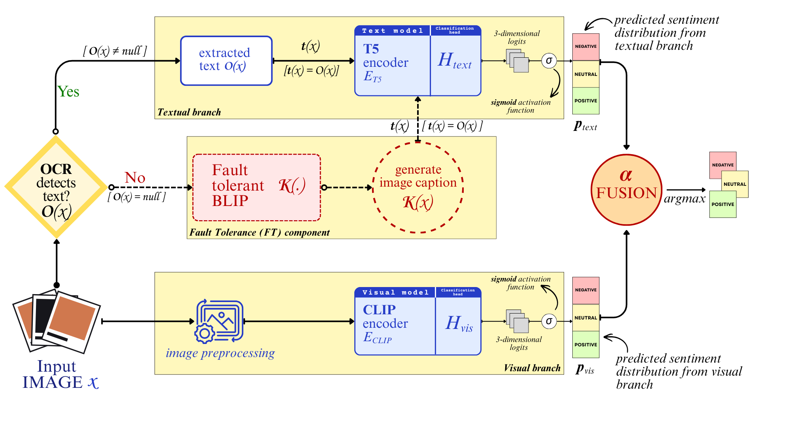

# MeViTSA: Multimodal Ensemble Approach for Sentiment Analysis of Visuals Integrated Text Data

**Authors:** Soham Bhattacharya<sup>1,3</sup>, Ali Reza Alaei<sup>2</sup> & Umapada Pal<sup>3</sup>

**Affiliated institutions:** <sup>1</sup>Ramakrishna Mission Vivekananda Educational and Research Institute Belur, India; <sup>2</sup>Southern Cross University, Australia; <sup>3</sup>Indian Statistical Institute Kolkata, India;


### Primary contributions
* The development of an enhanced MSA framework that demonstrates superior performance over the existing baselines
* The integration of a novel Fault-Tolerance (FT) mechanism that ensures architectural robustness and handles out-of-distribution (OOD) data which are faulty inputs
* Extending and a comprehensive curation and refinement of the dataset DocImsent introduced by Ahuja et. al (2024) to improve data quality and volume of the dataset.

## Architecture



## Important note about usage: Trained models required

The file `app.py` included in this repository serves as the **frontend interface** for the inference engine. 

> **CRITICAL:** > This application **will not function** without the pre-trained model weights (e.g., `best_model.pth` or checkpoint files). Due to file size limitations, these model files are **not included** in this repository.

### Required Directory Structure
To run the application successfully, you must maintain the following file structure. Ensure your downloaded models are placed specifically in the src/trained/ directory:

```mevitsa/
├── data/
├── src/
│   ├── app.py             # Main Application
|   ├── model.py           # framework code   
|   ├── evaluation.py      # evaluation code
│   ├── trained/           # <--- PLACE MODELS HERE
│   │   ├── CLIP__best_model.pt
│   │   └── T5__best_model.pt
│   └── utils/             # (Supporting scripts)
|   └── models/            # (Code for each branch)
├── configs/
│   └── config-models.json # (Configuration settings)
└── requirements.txt
```

**How to get the models:**
Please **contact the author** directly to request access to the trained model files. Once received, place them in the `src/trained/` folder before running the application.


## Installation

1.  **Clone the repository**
    ```bash
    git clone [https://github.com/soham-b-github/msa.git](https://github.com/soham-b-github/msa.git)
    cd msa
    ```

2.  **Install dependencies**
    ```bash
    pip install -r requirements.txt
    ```
    *Key requirements:* `torch`, `transformers`, `google-cloud-vision`, `clip` (OpenAI), `Pillow`, `flask` / `streamlit` (for app.py).

3.  **Setup Google Cloud credentials**
    * Export your service account key:
        ```bash
        export GOOGLE_APPLICATION_CREDENTIALS="path/to/your/service-account-file.json"
        ```


## Running the App

Once you have obtained the trained model files from the author:

1.  Ensure the model file is in the correct directory.
2.  Run the frontend application:
    ```bash
    streamlit run app.py
    ```
3.  Upload an image (e.g., a meme or poster) to receive the predicted sentiment (Positive, Negative, or Neutral).

## Evaluation setup

To evaluate the framework, you can either use the samples provided in this repository or integrate your own dataset. The system expects a specific directory hierarchy within the `data/` folder:

- **Using provided samples**: The repository includes sample images located in `data/docimsentv1-samples/` and `data/external-samples/ `. These are ready for immediate testing.
- **Using custom datasets**: If you wish to evaluate the framework on a full dataset, create a new subdirectory within the `data/` folder and place your images there.
- Run the following code in the terminal:
```bash
python3 evaluation.py --DATASET_PATH=./../data/my_new_dataset
```

Recommended directory structure for `data/` folder:

```mevitsa/
├── data/
│   ├── docimsentv1-samples/  # Existing sample data
│   ├── external-samples/     # Existing sample data
│   └── [your-dataset-name]/  # <--- PLACE CUSTOM DATASETS HERE
│       ├── image_001.jpg
│       └── image_002.png
```
